# Javier Lucia Marco

Software engineer focused on backend systems, applied AI, and infrastructure.

I build and run production systems end to end: APIs, workers, data, AI workflows, deployment pipelines, and the applications around them.

Most of my repositories are private because they are commercial products in use. This page says what they do and what I owned. Happy to walk through any of them, or share code under NDA.

📍 Zaragoza, Spain · [j.luciamarco@gmail.com](mailto:j.luciamarco@gmail.com) · [LinkedIn](https://linkedin.com/in/javier-lucia-marco)

---

| Project | What it is | Stack | Status |
|---|---|---|---|
| **[Lexground](https://github.com/JLM-2000/Lexground)** | Grounded RAG over EU regulatory law with hybrid lexical + vector retrieval, evaluation and regression gates, and reproducible infrastructure | Python · FastAPI · PostgreSQL · pgvector · Next.js · Terraform | public |
| **iFlySEO** | Production SaaS for scheduled SEO generation and automated WordPress publishing, with background processing, deployment, observability, and reliability-oriented workflows | FastAPI · Celery · Redis · PostgreSQL · PHP · Prometheus · Grafana | private · live |
| **[Canon-Quill](https://github.com/JLM-2000/Canon-Quill)** | Agentic book-writing workflows grounded in existing writing, with style and continuity validation over structured state | TypeScript · LLM orchestration · MCP · Google Drive API | public |
| **Arista** | Mountain-guide marketplace built collaboratively with `jcasasus5`, connecting clients with verified guides and supporting activities, availability, GPS routes, bookings, and payouts | FastAPI · PostgreSQL · PostGIS · Redis · Arq · Stripe Connect · Next.js · TypeScript | private |
| **SeatWise** | Constraint-based seating optimisation using hard and soft preferences to find the best feasible arrangement within a fixed budget | Python · FastAPI · Pydantic 2 | private |

---

## Lexground, grounded retrieval over EU law

Retrieval over a corpus is the easy half. The half I cared about is knowing whether a change made the answers *worse*, because a degraded RAG system does not throw an exception, it returns a confident wrong answer.

So there is a golden set, seven metrics, thresholds in version control, and a build that goes red when retrieval quality drops or a quoted passage turns out not to be in the article it cites. Hybrid BM25 + dense retrieval with reciprocal rank fusion, one Postgres instance backing both arms.

The result I am most pleased with is a debugging one. Groundedness sat at 0.61 with a huge spread until I read the judge's *rationales* instead of its scores: my harness was filtering context down to the cited chunks and renumbering them from 1, so the answers' citation markers pointed at nothing. The judge was right and my harness was broken. Fixing it took groundedness to 0.967 with zero variance across five runs, and the one case that still fails is a genuine cross-reference trap, which is the evidence the jump came from fixing a bug rather than from a softer prompt.

## iFlySEO, AI content platform for WordPress

**Live commercial product.** Analyses a customer's website, infers their service lines, and generates and publishes SEO content on a schedule. Sold through a WooCommerce storefront with per-domain word accounting.

A FastAPI service plus four Celery queues behind Redis, with leased tasks, fenced completion and heartbeats so a dead worker cannot strand a job. Generation runs through a validation layer (hard and soft constraints, candidate scoring, bounded retries) with an auditable record of every paid provider response. Measuring the failures instead of guessing at them cut wasted paid retries from 8 per four articles to 2.

I also wrote the two WordPress plugins in PHP (signed auto-update, an Ed25519-signed kill switch), the HMAC-signed API boundary, and the deploy pipeline: linting, tests, Semgrep, immutable image tags, health-gated deploy with automatic rollback. I also run it: VPS, Prometheus and Grafana, tamper-evident audit logging, backups, incidents.

~1.9 MB across Python, JavaScript, PHP and shell. 443 backend tests, plus offline rendering tests for the plugins that run in CI without a WordPress install.

## Canon-Quill, agentic book writing

Getting an LLM to produce text is not the hard part. Getting text that sounds like *the author* wrote it, and where chapter 12 still agrees with chapter 3, is.

Both are handled as measurement problems rather than prompt instructions. The author's past books are cut into passages tagged by narrative beat; the closest precedent for each scene is retrieved into the drafting prompt, so the model writes next to real examples instead of a description of a style. Drafts are then scored against a quantitative fingerprint of their own prose (sentence-length distribution, dialogue share, tag habits, filter-verb and abstraction rates), and the editing pass works from the named deviations.

Continuity is a typed contract between chapters rather than a summary document: a character relocating with no travel shown, someone acting on a fact they were never shown learning, or a thread past its resolve-by chapter all fail a gate in code.

## Arista, mountain-guide application

Arista is a mountain-guide marketplace built collaboratively with `jcasasus5`.
The first markets are Spain and the French Pyrenees. Clients can search by zone,
activity, difficulty, or date, inspect GPS and GPX route information, book
verified professional guides, and pay through the platform. Guides manage their
profiles, certifications, activities, recurring availability, bookings, routes,
messages, and Stripe Connect payouts. The product also includes reviews,
administration, internationalised frontend routes, and a PWA frontend.

The application is split between an async FastAPI backend and a Next.js
frontend, with PostgreSQL and PostGIS for the marketplace data and geography,
Redis and Arq for background work, and Docker-based local infrastructure.

For a real guide outreach campaign around Arista, I built a separate outreach
application and its code rather than adding campaign logic to the main product.
It synchronises paginated AEGM directory listings, enriches individual profiles
on demand, tracks each contact through a SQLite state machine, and prepares
personalised email batches. Sending is safe by default, so a misconfiguration
sends nothing rather than a live batch.

## SeatWise, constraint-based seating optimiser

Assigns guests to tables under real constraints (who must sit together, who must be kept apart, table capacities) and returns the best arrangement it can find within a wall-clock budget.

Every arrangement is scored with a breakdown where hard constraints carry penalties orders of magnitude larger than soft ones, so the optimiser never trades a "must not sit together" for a nicety. Bounded hill climbing with random restarts, and a union-find pass that resolves "must sit together" chains into components before placement. The solver is deliberately isolated from the API so it can be tested on its own.

---

## Portfolio media

Screenshots and short demos captured from the running applications. Full sets, including exported artifacts, live in [`assets/`](assets/).

### Lexground — grounded RAG with evaluation gates

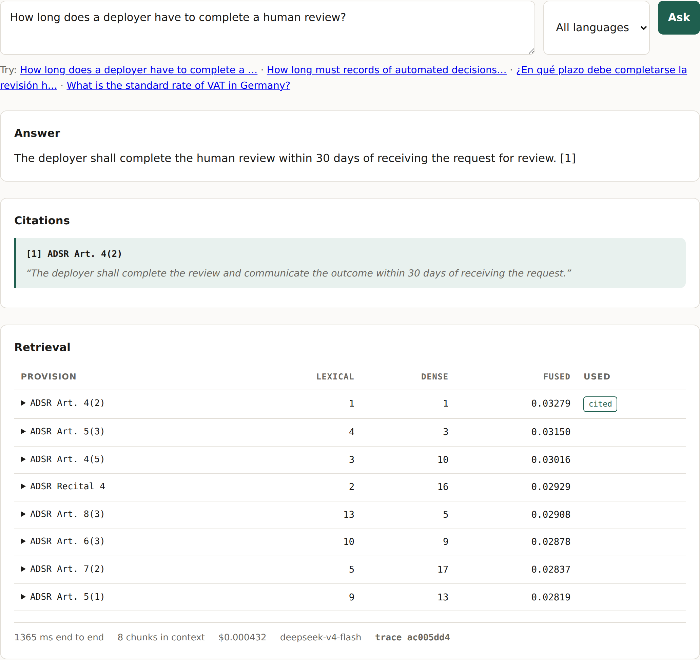 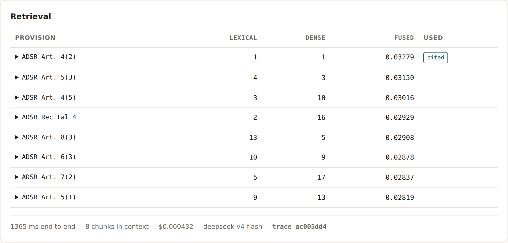 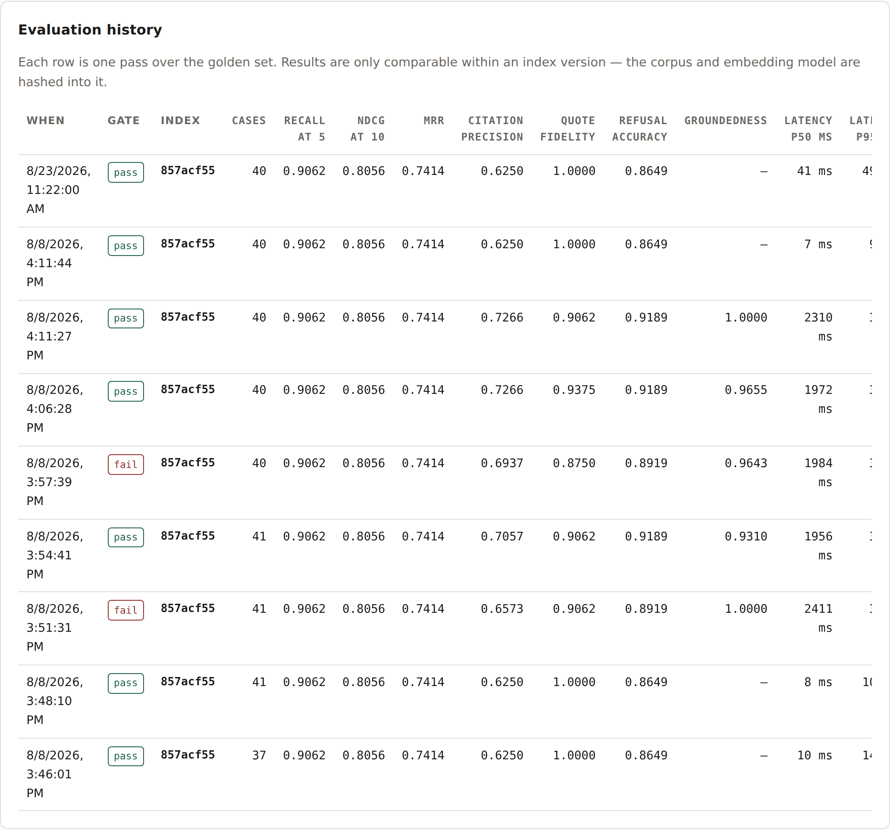

<video src="assets/lexground/lexground-demo.mp4" controls width="640"></video>

### Canon-Quill — agentic book writing grounded in the author's voice

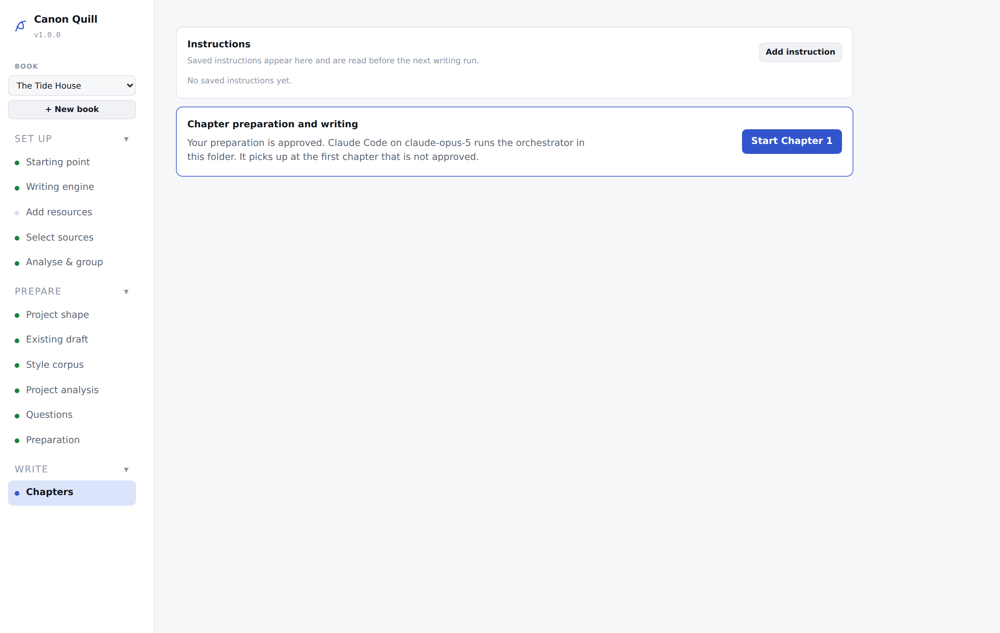 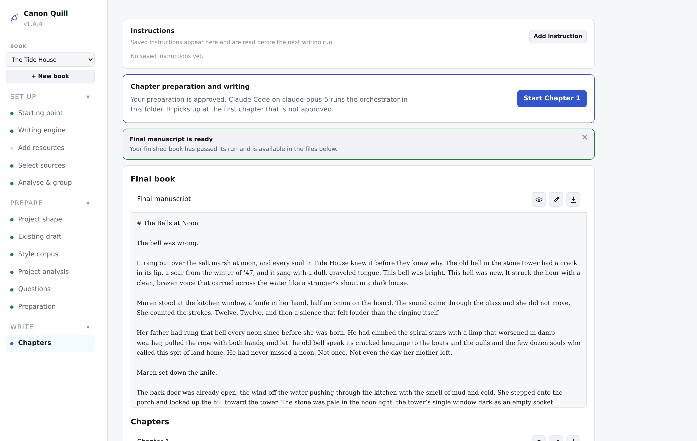 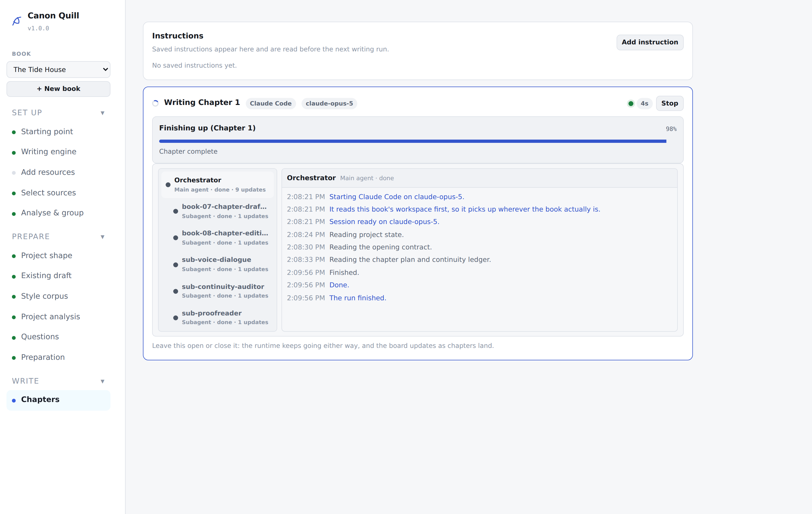

<video src="assets/canon-quill/canonquill-demo.mp4" controls width="640"></video>

Exported chapter: [`assets/canon-quill/1-canonquill-chapter.docx`](assets/canon-quill/1-canonquill-chapter.docx)

### iFlySEO — AI content platform for WordPress and beyond

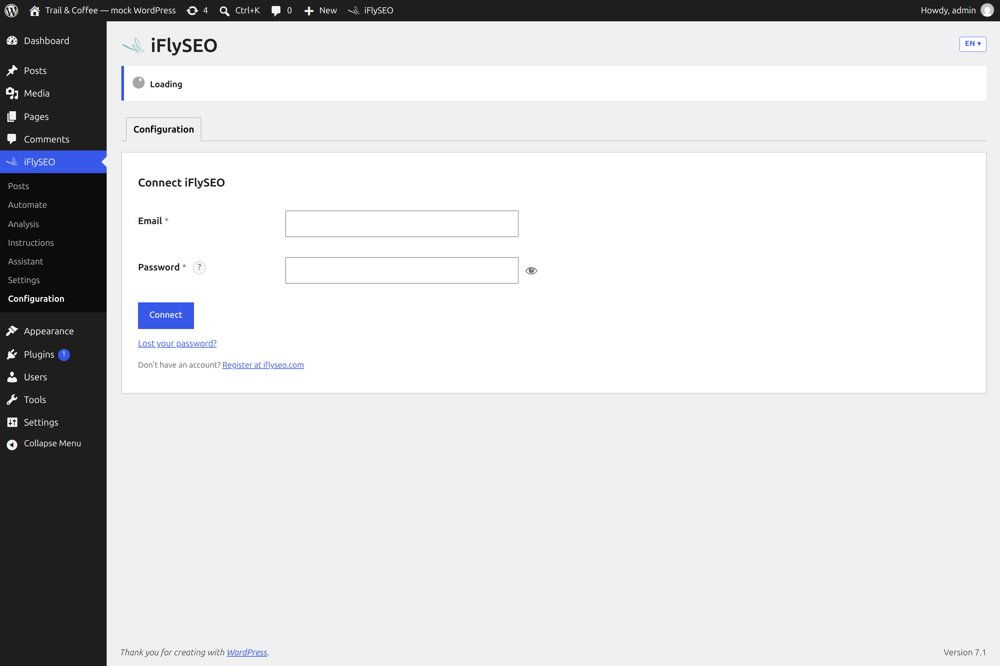 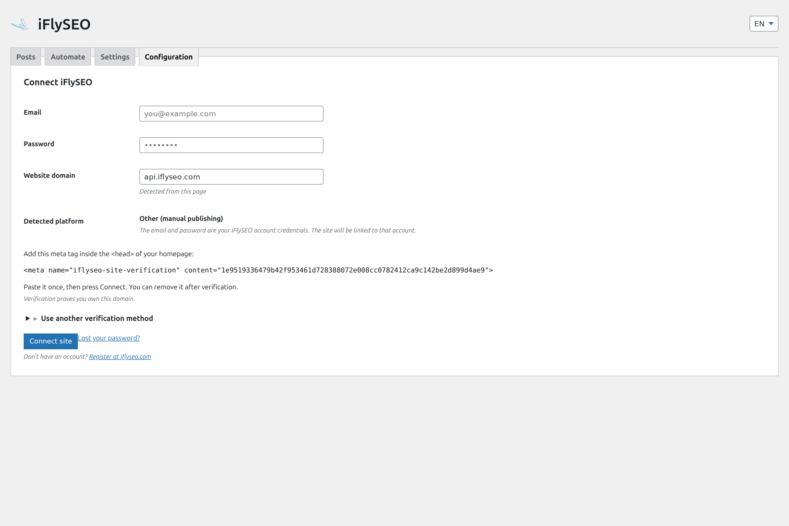 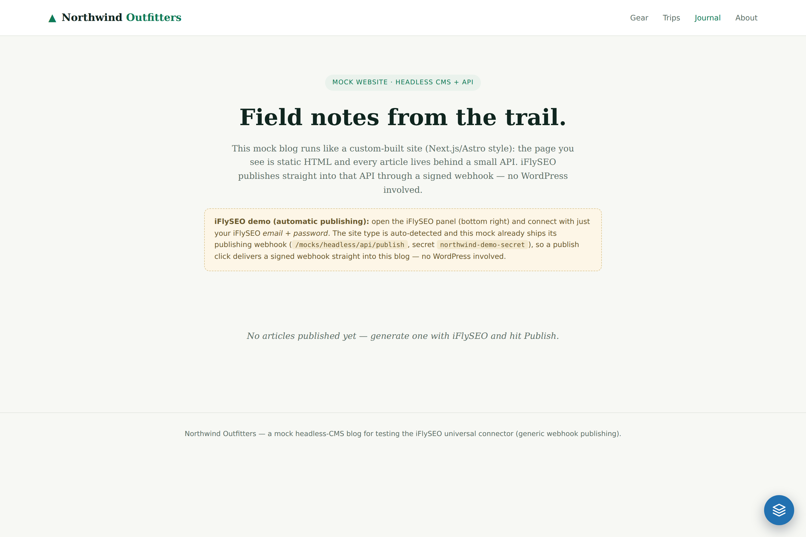

### SeatWise — constraint-based seating optimiser

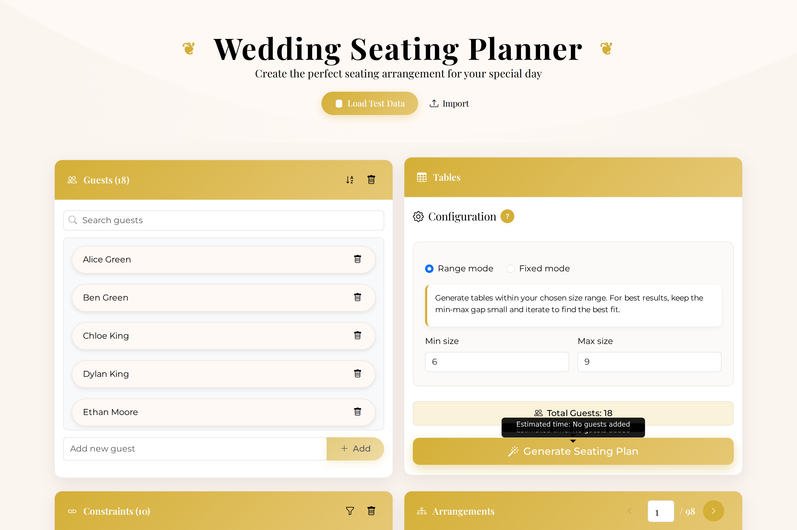 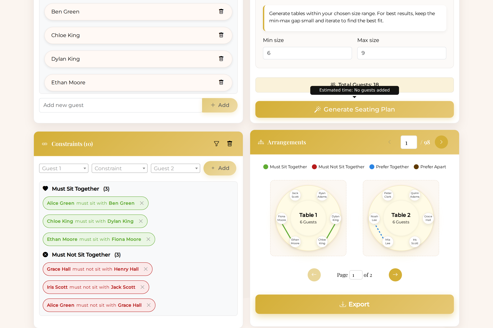 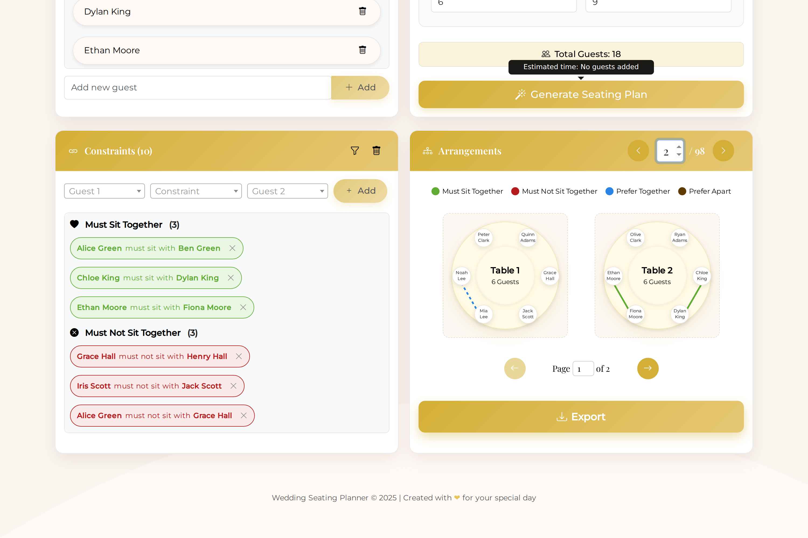

<video src="assets/seatwise/seatwise-demo.mp4" controls width="640"></video>

Exported plan bundle: [`assets/seatwise/4-seatwise-export.zip`](assets/seatwise/4-seatwise-export.zip)

---

## How I work

Tests and CI on everything that ships; a red pipeline blocks the deploy. Migrations reviewed and reversible, production data backed up before destructive work. I measure before I optimise, and I report what the numbers actually say, including when they say the thing I built did not help.

Contribution activity includes private repositories, so the graph reflects real daily work even though most of the code is not public.
